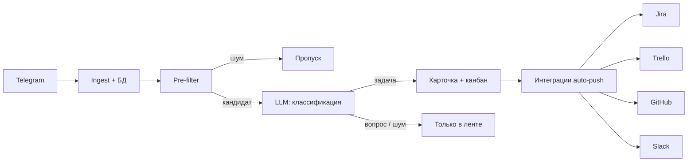

# TaskExtraction

Панель для команд поддержки: **сообщения из Telegram → классификация LLM → задачи на канбане → синхронизация с Jira, Trello, GitHub Issues и Slack**.

Один Docker-образ, SQLite на диске, настройка через веб-интерфейс без правки кода.

---

## Суть продукта

В рабочих чатах поддержки поручения теряются в потоке переписки. TaskExtraction подключается к выбранным группам и каналам как **user-клиент Telegram**, сохраняет сообщения, отделяет задачи от вопросов и «шума», создаёт карточки в панели и при необходимости отправляет их во внешние трекеры.

**Позиционирование:** не полноценный таск-менеджер, а тонкий слой «чат → учёт задач» с минимальным UI (лента, канбан, настройки).

---

## Подход к решению

Обработка каждого сообщения идёт **конвейером** — от дешёвых правил к дорогому LLM только там, где это нужно:



| Этап | Что делает |
|------|------------|
| **Ingest** | Telethon получает новые сообщения, сохраняет текст, метаданные и вложения |
| **Pre-filter** | Эвристики без LLM: пустой текст, типовой шум, короткие реплики |
| **Классификация** | LLM определяет: задача, вопрос или нерелевантное |
| **Извлечение** | Для задач — заголовок, описание, приоритет, исполнитель (по промпту) |
| **Панель** | Канбан (Inbox → В работе → Готово → Архив) и лента с контекстом |
| **Интеграции** | Адаптеры с единым интерфейсом; ручной или автоматический push |

Ключевые принципы:

- **Секреты не в коде** — Telegram API, токены Jira/GitHub/Slack и свой LLM-ключ хранятся зашифрованно в БД (`ENCRYPTION_KEY` + Fernet).
- **Один образ для деплоя** — nginx + FastAPI в контейнере, данные на volume.
- **Расширяемость** — реестр адаптеров (`IssueTrackerPort`) для новых трекеров без переписывания пайплайна.

---

## Возможности

- Подключение Telegram через UI (api_id / api_hash, QR или телефон, выбор чатов)
- Канбан из четырёх колонок и модальная карточка задачи со ссылкой на сообщение
- Лента сообщений с классификацией, поиском и просмотром вложений
- WebSocket: новые сообщения и задачи без перезагрузки страницы
- Настраиваемый промпт и OpenAI-совместимый LLM API
- Интеграции: **Jira Cloud**, **Trello**, **GitHub Issues**, **Slack** (auto-push и ручная отправка)
- Промо-страница `/welcome` и пошаговый гайд для новичков

---

## Стек

| Слой | Технологии |
|------|------------|
| Backend | Python 3.12, FastAPI, SQLAlchemy 2, Alembic, Telethon, aiosqlite |
| Frontend | React 18, TypeScript, Vite |
| БД | SQLite (файл на volume) |
| Деплой | Docker (linux/amd64), nginx |

---

## Быстрый старт (Docker Hub)

Образ: [`bondarevevgeni/taskextraction:latest`](https://hub.docker.com/r/bondarevevgeni/taskextraction)

```bash
# 1. Ключ шифрования (сохраните — понадобится при каждом запуске с тем же volume)
python3 -c "from cryptography.fernet import Fernet; print(Fernet.generate_key().decode())"

# 2. Каталог для данных на хосте
mkdir -p ./taskextraction-data

# 3. Запуск
docker run -d \
  --name taskextraction \
  --restart unless-stopped \
  -p 8080:80 \
  -v "$(pwd)/taskextraction-data:/app/data" \
  -e ENCRYPTION_KEY="ВСТАВЬТЕ_FERNET_КЛЮЧ" \
  bondarevevgeni/taskextraction:latest
```

Панель: **http://localhost:8080**  
Промо-страница: **http://localhost:8080/welcome**

В `./taskextraction-data` сохраняются:

- `taskextraction.db` — база
- `media/` — вложения
- `session/` — сессия Telegram

---

## Разработка (docker compose)

```bash
git clone https://github.com/<user>/TaskExtraction.git
cd TaskExtraction
cp .env.example .env
# Заполните ENCRYPTION_KEY в .env

docker compose up --build
```

- Frontend: http://localhost:5173  
- API / Swagger: http://localhost:8000/docs  

Локальная авторизация Telegram (альтернатива UI):

```bash
cd backend
python -m venv .venv && source .venv/bin/activate
pip install -r requirements.txt
export $(grep -v '^#' ../.env | xargs)
python ../scripts/telegram_login.py
```

Сборка и публикация образа (amd64):

```bash
./scripts/docker-publish.sh
```

---

## Конфигурация

| Переменная | Назначение |
|------------|------------|
| `ENCRYPTION_KEY` | Fernet-ключ для секретов в БД (**обязательно**) |
| `DATABASE_URL` | SQLite (по умолчанию `/app/data/taskextraction.db` в Docker) |
| `MEDIA_DIR` | Каталог вложений |
| `TELEGRAM_SESSION_PATH` | Файл сессии Telethon |
| `PUBLIC_API_URL` | Базовый URL панели для ссылок в тикетах |
| `CORS_ORIGINS` | Разрешённые origin для API |

Telegram, LLM и интеграции настраиваются в UI (**Настройки**). Переменные в `.env` — запасной вариант.

---

## Структура репозитория

```
TaskExtraction/
├── backend/           # FastAPI, Telethon, пайплайн, Alembic
│   ├── app/
│   │   ├── api/       # REST + WebSocket
│   │   ├── extraction/# prefilter, LLM, pipeline
│   │   ├── integrations/
│   │   └── telegram/
│   └── alembic/
├── frontend/          # React-панель
├── docker/            # nginx.conf, entrypoint для единого образа
├── Dockerfile         # production-образ (UI + API)
├── docker-compose.yml # локальная разработка
├── scripts/           # telegram_login, docker-publish
└── doc/               # дорожная карта (DEVELOPMENT_ROADMAP.md)
```

---

## Безопасность

- Не коммитьте `.env`, `*.session`, каталоги `data/`, `media/`, файлы `*.db`.
- После утечки `api_hash` перевыпустите ключи на [my.telegram.org](https://my.telegram.org/apps).
- Для продакшена укажите **свой** LLM API-ключ в настройках панели.
- `ENCRYPTION_KEY` при смене делает старые зашифрованные поля в БД нечитаемыми — храните ключ отдельно от бэкапа БД или бэкапьте оба вместе.

Подробнее: раздел «Безопасность» в [doc/DEVELOPMENT_ROADMAP.md](doc/DEVELOPMENT_ROADMAP.md).

---

## Документация

- [Дорожная карта и архитектура](doc/DEVELOPMENT_ROADMAP.md)

---

## Контакты

Вопросы и обратная связь: [@Burn1ngSnow](https://t.me/Burn1ngSnow) в Telegram.

---

## Лицензия

[MIT](LICENSE)
