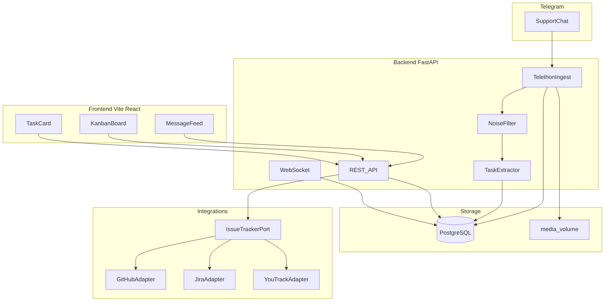

# TaskExtraction — дорожная карта разработки

> Автоматическое извлечение задач из Telegram-чата поддержки в простую панель (упрощённый аналог Weeek) с заделом на Jira / YouTrack / GitHub Issues.

**Версия документа:** 1.0  
**Дата:** 2026-05-16  
**Статус репозитория:** MVP scaffold + roadmap

---

## Содержание

1. [Резюме и глоссарий](#1-резюме-и-глоссарий)
2. [Аналоги и позиционирование](#2-аналоги-и-позиционирование)
3. [Стек и архитектура](#3-стек-и-архитектура)
4. [Модель данных](#4-модель-данных)
5. [Этапы разработки](#5-этапы-разработки)
6. [Промпт LLM и JSON-schema](#6-промпт-llm-и-json-schema)
7. [Переменные окружения](#7-переменные-окружения)
8. [Структура репозитория](#8-структура-репозитория)
9. [Безопасность](#9-безопасность)
10. [Риски](#10-риски)
11. [Чеклист «готово к продакшену»](#11-чеклист-готово-к-продакшену)

---

## 1. Резюме и глоссарий

### 1.1 Суть проекта

**TaskExtraction** — тонкий слой между чатом поддержки в Telegram и задачами команды:

```
Новое сообщение в TG → фильтр шума → LLM → задача в панели → (опционально) Jira/GitHub
```

Прототип в [`doc/Untitled1.ipynb`](Untitled1.ipynb) подтвердил:

- Telethon читает группу поддержки InterParts (заказы, поставщики, UI-баги).
- Сообщения экспортируются в JSON с медиа.
- Real-time listener (`NewMessage`) работает как основа ingest.

**Не делаем:** CRM, Gantt, базу знаний, мобильные приложения, обязательные хештеги, OCR на MVP.

### 1.2 Глоссарий

| Термин | Значение |
|--------|----------|
| **Ingest** | Получение сообщений из Telegram и запись в БД |
| **Inbox** | Статус/колонка новых автосозданных задач |
| **InterParts** | Продукт (автозапчасти, заказы); домен чата поддержки |
| **Pre-filter** | Правила без LLM: стоп-фразы, пустой текст |
| **Confidence** | Уверенность LLM (0–1); порог создания задачи: ≥0.7 |
| **Reply-chain** | Цепочка ответов в Telegram (`reply_to`) |
| **IssueTrackerPort** | Интерфейс адаптера для Jira/GitHub/YouTrack |

---

## 2. Аналоги и позиционирование

| Решение | URL | Плюсы | Минусы для нас | Наш ответ |
|---------|-----|-------|----------------|-----------|
| **Weeek** | https://weeek.net/ru | Задачи, доски, CRM, ИИ | Перегруз; нет «чат → задача» | Только inbox + канбан 4 колонки + ссылка на TG |
| **Entergram** | entergram.com | Тикеты из Telegram, SLA | SaaS, CRM | Self-hosted, один чат |
| **telegit** | github.com/majus/telegit | LLM + GitHub, реакции | #теги, Node+Mongo, нет панели | Real-time без тегов; своя панель |
| **telegram-jira-bot** | github.com/abdusalamov/telegram-jira-bot | Jira из TG | Ручные команды, без LLM | LLM отсекает болтовню |
| **telegram-support-bot** | github.com/bostrot/telegram-support-bot | LLM FAQ | Бот для клиентов | User-client в существующей группе |

**Позиционирование:** не «ещё один таск-менеджер», а **3 экрана, 4 статуса, zero-config для оператора чата**.

---

## 3. Стек и архитектура



| Слой | Технология | Почему |
|------|------------|--------|
| Backend | Python 3.12, FastAPI, Telethon, SQLAlchemy, Alembic | Прототип на Telethon |
| БД | PostgreSQL 16 | JSONB, надёжность |
| LLM | OpenAI-compatible API | Один клиент, смена провайдера в `.env` |
| Frontend | React 18 + Vite | Канбан drag-n-drop |
| Деплой | Docker Compose | `docker compose up` |

---

## 4. Модель данных

### 4.1 ER (ядро)

```
chats ──< messages ──< tasks
                    └──< task_comments
tasks ──< external_links
integration_settings (singleton per provider)
```

### 4.2 Таблицы

**chats**

| Поле | Тип | Описание |
|------|-----|----------|
| id | UUID PK | |
| telegram_chat_id | BIGINT UNIQUE | Напр. -1002056938512 |
| title | VARCHAR | Название группы |

**messages**

| Поле | Тип | Описание |
|------|-----|----------|
| id | UUID PK | |
| chat_id | UUID FK | |
| telegram_message_id | BIGINT | UNIQUE вместе с chat_id |
| user_id | BIGINT | sender_id |
| user_display_name | VARCHAR | Кэш из get_entity |
| text | TEXT | |
| reply_to_telegram_id | BIGINT NULL | |
| media_path | VARCHAR NULL | |
| raw | JSONB | Полный payload |
| created_at | TIMESTAMPTZ | |

**tasks**

| Поле | Тип | Описание |
|------|-----|----------|
| id | UUID PK | |
| source_message_id | UUID FK UNIQUE | Одна задача на сообщение-источник |
| title | VARCHAR(500) | |
| description | TEXT | |
| type | ENUM | bug, feature, question, other |
| priority | ENUM | low, medium, high |
| status | ENUM | inbox, in_progress, done, archive |
| assignee | VARCHAR NULL | Из ASSIGNEES в .env |
| confidence | FLOAT | От LLM |
| created_at | TIMESTAMPTZ | |
| updated_at | TIMESTAMPTZ | |

**task_comments** — доп. сообщения в reply-chain к той же задаче.

**external_links** — связь с GitHub/Jira/YouTrack.

---

## 5. Этапы разработки

### Этап 0. Инициализация репозитория (2–3 дня)

**Цель:** воспроизводимый проект вместо ноутбука.

#### Задачи

- [x] Структура `backend/`, `frontend/`, `docker-compose.yml`, `.env.example`
- [x] `backend/app/telegram/ingest.py` — логика из ноутбука
- [x] Скрипт `scripts/telegram_login.py` — QR-авторизация
- [x] Alembic: миграции `chats`, `messages`, `tasks`
- [x] Session в Docker volume `telegram_sessions`

#### Критерии приёмки

- `docker compose up` поднимает API + PostgreSQL
- При настроенной сессии новые сообщения пишутся в `messages`
- Секреты только в `.env` (не в коде)

#### Принцип простоты

Один `TELEGRAM_CHAT_ID` в конфиге. Без UI настроек чатов.

#### Анти-паттерны

- Не хранить `api_hash` в ноутбуке/репозитории
- Не поднимать Redis на MVP

#### Трудности

| Проблема | Решение |
|----------|---------|
| QR timeout в Colab | Локальный `telegram_login.py` |
| Flood-wait | `flood_sleep_threshold` Telethon |
| Session в контейнере | Named volume |

---

### Этап 1. Лента сообщений (3–4 дня)

**Цель:** видеть поток чата в вебе до LLM.

#### Задачи

- [x] `GET /api/messages` — пагинация `limit`, `offset`, `since`
- [x] `GET /api/messages/{id}` — одно сообщение
- [x] WebSocket `/ws/messages` — push новых
- [x] Frontend: страница «Лента»
- [x] `UNIQUE(chat_id, telegram_message_id)`

#### Критерии приёмки

- История отображается в браузере
- Новое сообщение за &lt;5 сек (WS или poll 3 сек)

#### Принцип простоты

Одна лента, без дерева тредов в UI (данные `reply_to` уже в БД).

#### API

```
GET /api/messages?limit=50&offset=0
GET /api/messages/{id}
WS  /ws/messages
```

---

### Этап 2. LLM-извлечение задач (5–7 дней)

**Цель:** realtime_auto — задача или игнор.

#### Задачи

- [x] `app/extraction/prefilter.py` — стоп-фразы, длина, пустота
- [x] `app/extraction/llm.py` — OpenAI-compatible, structured output
- [x] `app/extraction/pipeline.py` — оркестрация после ingest
- [x] Контекст: reply-chain + последние 5 сообщений user
- [x] `POST /api/tasks/reprocess/{message_id}` — ручной перезапуск
- [x] Тесты prefilter + schema validation

#### Критерии приёмки

- «Спасибо», «Минуту», «Не-а» без контекста бага → не задача
- «верните стрелки поставщиков» → задача type=feature/bug, confidence≥0.7
- Precision ≥80% на 15–20 размеченных эталонах из sample

#### Принцип простоты

Один system prompt, один вызов LLM, без fine-tuning.

#### Порог создания

```python
if result.is_task and result.confidence >= 0.7:
    create_task(...)
```

#### Трудности

| Проблема | Решение |
|----------|---------|
| Ложные срабатывания в треде | reply_to в контексте промпта |
| Стоимость API | Не переобрабатывать message_id |
| Домен InterParts | 5–10 few-shot в system prompt |

---

### Этап 3. MVP панели (7–10 дней)

**Цель:** упрощённый Weeek для поддержки.

#### Задачи

- [x] Канбан: Inbox → В работе → Готово → Архив
- [x] Карточка: title, description, type, priority, assignee, ссылка на TG
- [x] `PATCH /api/tasks/{id}` — обновление
- [x] Кнопка «Не задача» → status=archive + `task_feedback`
- [x] Drag-n-drop (dnd-kit) или смена статуса dropdown

#### Критерии приёмки

- Оператор за 30 сек видит источник и меняет статус
- Ссылка `t.me/c/{chat_id_without_prefix}/{message_id}` открывается

#### Принцип простоты

Один проект «Support». Assignee — список из `ASSIGNEES` в `.env`.

#### Не в MVP

Проекты, теги, Gantt, календарь, email-уведомления.

#### API

```
GET  /api/tasks?status=inbox
GET  /api/tasks/{id}
PATCH /api/tasks/{id}
POST /api/tasks/{id}/dismiss
```

---

### Этап 4. Дедупликация тредов (3–5 дней)

**Цель:** один баг — одна задача.

#### Задачи

- [ ] Если `reply_to` → сообщение уже с задачей → `task_comments`
- [ ] Иначе → новая задача (этап 2)

#### Критерии приёмки

- Диалог 2906–2909 (поставщики) → 1 задача, 2+ комментария

#### Принцип простоты

Только reply-chain, без embedding на MVP.

#### Статус

Заложено в `pipeline.py` (`_attach_to_parent_task`); доработка после MVP-тестов.

---

### Этап 5. Интеграции (5–7 дней)

**Цель:** задел Jira / YouTrack / GitHub.

#### Задачи

- [x] `IssueTrackerPort` Protocol
- [x] `GitHubAdapter` — create issue
- [x] Stubs: `JiraAdapter`, `YouTrackAdapter`
- [x] `POST /api/tasks/{id}/push/{provider}`
- [x] `external_links` таблица
- [x] UI: кнопка «Отправить в GitHub»

#### Критерии приёмки

- Ручной push создаёт Issue с title, body, ссылкой на TG
- Автосинк по умолчанию **выключен**

#### Принцип простоты

Push по кнопке. Без двустороннего sync на MVP.

---

### Этап 6. Надёжность (3–4 дня)

#### Задачи

- [x] `GET /health`
- [ ] Reconnect Telethon при обрыве (цикл retry в worker)
- [ ] Backup PostgreSQL (cron doc)
- [x] README: быстрый старт

#### Критерии приёмки

- Рестарт контейнера — ingest продолжается
- Алерт при ingest down &gt;5 мин (опционально)

---

### Этап 7. Бэклог (после MVP)

| Фича | Сложность | Когда |
|------|-----------|-------|
| Несколько чатов | Средняя | 2+ продукта |
| Embedding-дедуп | Высокая | Много дублей |
| OCR скриншотов | Высокая | Баги только на фото |
| Уведомление в TG «создана #123» | Низкая | По запросу |
| Basic auth | Средняя | &gt;1 оператор |

---

## 6. Промпт LLM и JSON-schema

### 6.1 System prompt (сокращённо)

Полный текст: `backend/app/extraction/prompts.py`

Ключевые правила для модели:

1. Язык: русский.
2. Продукт: InterParts — заказы, поставщики, UI.
3. Не создавать задачи из: «спасибо», «ок», «минуту», «не-а» без описания проблемы.
4. Учитывать контекст (предыдущие сообщения и reply).
5. Ответ — только JSON по схеме.

### 6.2 JSON-schema ответа

```json
{
  "type": "object",
  "required": ["is_task", "type", "title", "description", "priority", "confidence"],
  "properties": {
    "is_task": { "type": "boolean" },
    "type": { "enum": ["bug", "feature", "question", "other"] },
    "title": { "type": "string", "maxLength": 200 },
    "description": { "type": "string" },
    "priority": { "enum": ["low", "medium", "high"] },
    "confidence": { "type": "number", "minimum": 0, "maximum": 1 }
  }
}
```

### 6.3 Few-shot примеры (в промпте)

| Сообщение | is_task | type |
|-----------|---------|------|
| «Все, спасибо» | false | — |
| «При оформлении заказов не появилось поставщиков» | true | bug |
| «Пожалуйста, верните стрелки поставщиков» | true | feature |
| «ctrl + shift + r» | false | — (совет, не задача продукта) |

---

## 7. Переменные окружения

См. [`.env.example`](../.env.example) в корне репозитория.

| Переменная | Обязательно | Описание |
|------------|-------------|----------|
| `TELEGRAM_API_ID` | да | my.telegram.org |
| `TELEGRAM_API_HASH` | да | |
| `TELEGRAM_CHAT_ID` | да | ID группы поддержки |
| `TELEGRAM_SESSION_PATH` | нет | Путь к session (default: `/data/session`) |
| `DATABASE_URL` | да | `postgresql+asyncpg://...` |
| `LLM_API_KEY` | для этапа 2 | OpenAI / OpenRouter |
| `LLM_BASE_URL` | нет | Default: OpenAI |
| `LLM_MODEL` | нет | Default: `gpt-4o-mini` |
| `LLM_CONFIDENCE_THRESHOLD` | нет | Default: `0.7` |
| `ASSIGNEES` | нет | `Иван,Пётр,Мария` |
| `GITHUB_TOKEN` | для push | PAT с repo scope |
| `GITHUB_REPO` | для push | `owner/repo` |
| `MEDIA_DIR` | нет | `/data/media` |

---

## 8. Структура репозитория

```
TaskExtraction/
├── .env.example
├── docker-compose.yml
├── README.md
├── doc/
│   ├── DEVELOPMENT_ROADMAP.md   # этот файл
│   └── Untitled1.ipynb          # прототип (секреты удалены)
├── backend/
│   ├── Dockerfile
│   ├── requirements.txt
│   ├── alembic/
│   └── app/
│       ├── main.py
│       ├── config.py
│       ├── database.py
│       ├── models/
│       ├── schemas/
│       ├── api/
│       ├── telegram/
│       ├── extraction/
│       └── integrations/
├── frontend/
│   ├── package.json
│   └── src/
│       ├── pages/
│       └── components/
└── scripts/
    └── telegram_login.py
```

---

## 9. Безопасность

### 9.1 Утечка ключей из ноутбука

В прототипе [`Untitled1.ipynb`](Untitled1.ipynb) были захардкожены `api_id` и `api_hash`.

**Обязательные действия:**

1. Удалить ключи из ноутбука (заменить на `%env` / загрузку из `.env`).
2. Зайти на https://my.telegram.org → API development tools → **отозвать/перевыпустить** `api_hash`, если репозиторий мог утечь.
3. Никогда не коммитить: `.env`, `*.session`, `media/` с личными данными.
4. Добавить в `.gitignore`: `.env`, `*.session`, `telegram_sessions/`, `media/`.

### 9.2 Продакшен

- Корпоративный аккаунт поддержки для user-bot (документировать в README).
- Basic auth или VPN перед панелью при публичном хостинге.
- Ротация `GITHUB_TOKEN`, минимальные scopes.

---

## 10. Риски

| Риск | Вероятность | Митигация |
|------|-------------|-----------|
| LLM создаёт мусор | Высокая | pre-filter + confidence + Inbox |
| Telegram ToS | Низкая | Один служебный аккаунт |
| Дубли задач | Средняя | reply-chain (этап 4) |
| Стоимость LLM | Средняя | кэш по message_id |
| Короткие реплики в треде | Высокая | контекст reply в промпте |

---

## 11. Чеклист «готово к продакшену»

### Инфраструктура

- [ ] `.env` на сервере, не в git
- [ ] `docker compose up -d` без ошибок
- [ ] PostgreSQL backup настроен
- [ ] Volume для session и media

### Telegram

- [ ] Session авторизован (`scripts/telegram_login.py`)
- [ ] Ingest стабилен 24ч+
- [ ] `TELEGRAM_CHAT_ID` верный

### LLM

- [ ] Precision ≥80% на эталонной выборке
- [ ] Порог confidence проверен на реальном чате 1 неделю

### Панель

- [ ] 4 колонки канбана работают
- [ ] Ссылка на TG открывается
- [ ] «Не задача» архивирует

### Интеграции

- [ ] GitHub push вручную проверен
- [ ] Автосинк выключен по умолчанию

### Безопасность

- [ ] api_hash ротирован после ноутбука
- [ ] Доступ к панели ограничен

---

## Оценка сроков (1 разработчик)

| Этап | Дни | Статус в репо |
|------|-----|---------------|
| 0 | 2–3 | Scaffold готов |
| 1 | 3–4 | API + лента |
| 2 | 5–7 | Pipeline + тесты |
| 3 | 7–10 | Kanban UI |
| 4 | 3–5 | Частично в pipeline |
| 5 | 5–7 | GitHub adapter |
| 6 | 3–4 | health + README |
| **MVP** | **28–40** | |

---

*Документ согласован с планом TaskExtraction. Код — источник истины для API; при расхождении обновлять этот файл.*
